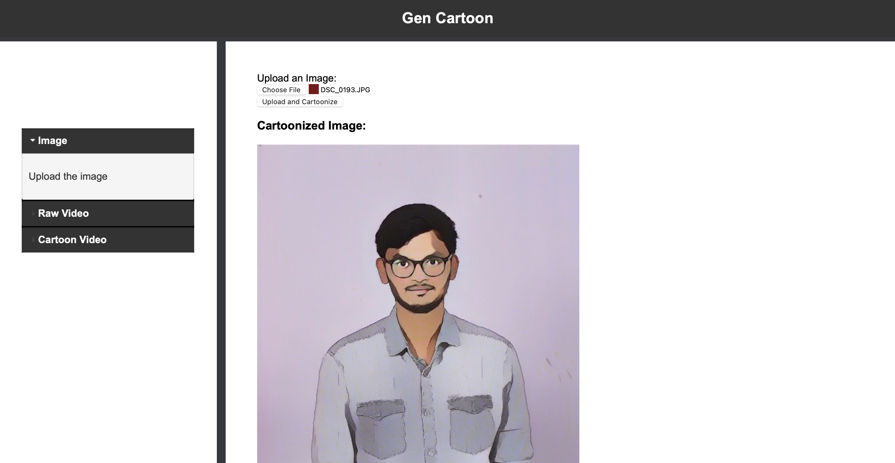

# Gen-Cartoon-Web-Application

Gen Cartoon is a web application that transforms live video feeds and uploaded images into cartoonized versions using a GAN(Generative Adversarial Network). The app features real-time video cartoonization and an option for users to upload and cartoonize images

## Features

* **Real-Time Cartoon Video:** Stream live video from a camera with a cartoon effect.
* **Image Upload and Cartoonization:**: Upload images and receive cartoonized version instantly
* **Simple User Interface:** Easy-to-use interface for smooth interaction.

## Screenshots

### Image Upload Form

### Cartoonized Image Output


### Live Cartoon Video
[Click here to view the cartoonized video](assets/CartoonGen.mp4)

Prerequisites
Before running the application, ensure you have the following installed:

* Python 3.9+
* Flask
* OpenCV
* TensorFlow
* Other Python libraries specified in requirements.txt
* Installation

## Clone the repository:

```
git clone https://github.com/pavanKumar2812/CartoonGAN-Web-App.git
```

### Navigate to the project directory:

```
cd gen-cartoon-webapp
```

### Create and activate a virtual environment:

```
python3 -m venv env
source env/bin/activate  # On Windows use `env\Scripts\activate`
```

### Install the required packages:

```
pip install -r requirements.txt
```

### Running the Application
To start the Flask application, run:

```
python main.py
The app will be available at http://127.0.0.1:5000.
```

**Usage**
* Home Page: Access the main page to interact with the video and image upload features.
* Upload an Image: Use the form to upload an image and receive a cartoonized version.
* Stream Video: View live video with a cartoon filter applied.

## Project Structure

```
gen-cartoon-webapp/
│
├── static/
│   ├── styles.css
│   ├── script.js
│   └── cartoonized/  # Folder for storing processed images
│
├── templates/
│   └── index.html  # Main HTML template
│
├── main.py  # Main Flask application script
├── GenerateFrames.py  # Module for generating video frames
├── CartoonFrames.py  # Module for cartoonizing images and video frames
├── requirements.txt  # Python dependencies
└── README.md  # This file
```

## Contributing
If you'd like to contribute to this project:

1. Fork the repository.
2. Create a feature branch (`git checkout -b feature-branch`).
3. Commit your changes (`git commit -m 'Add feature'`).
4. Push to the branch (`git push origin feature-branch`).
5. Create a pull request.

## Acknowledgments
Thanks to the developers of Flask, OpenCV, TensorFlow, and other libraries that made this project possible.
Special thanks to any collaborators or inspirations you wish to credit.
